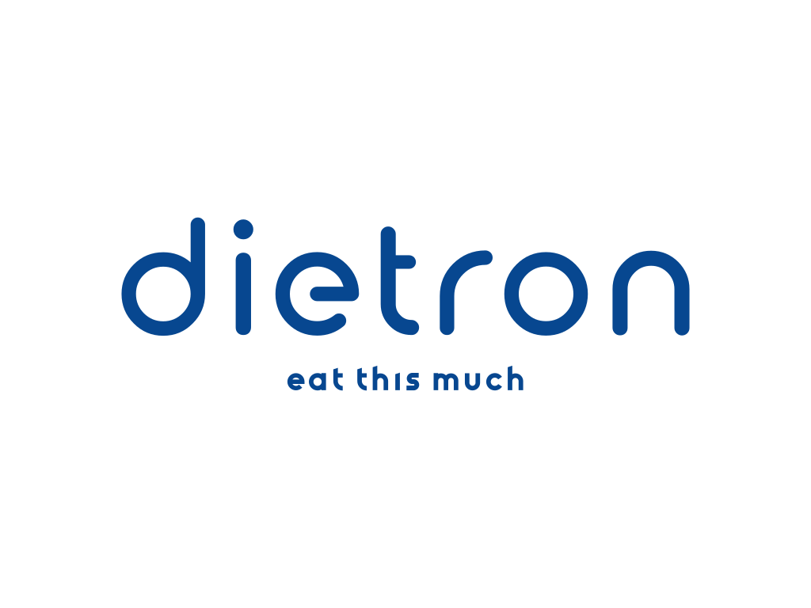

   
  
    a meal planner, since I'm bit lazy to do it myself.
  

 

  
   

## Safety

This crate uses `#![deny(unsafe_code)]` to ensure everything is implemented in
100% Safe Rust.

## Contributing

Want to join us? Check out our ["Contributing" guide][contributing] and take a
look at some of these issues:

- [Issues labeled "good first issue"][good-first-issue]
- [Issues labeled "help wanted"][help-wanted]

[contributing]: https://github.com/shekohex/dietron/blob/master/.github/CONTRIBUTING.md
[good-first-issue]: https://github.com/shekohex/dietron/labels/good%20first%20issue
[help-wanted]: https://github.com/shekohex/dietron/labels/help%20wanted

## License

Licensed under <a href="LICENSE">MIT license</a>.

 

Unless you explicitly state otherwise, any contribution intentionally submitted
for inclusion in this crate by you, as defined in the Apache-2.0 license, shall
be dual licensed as above, without any additional terms or conditions.

